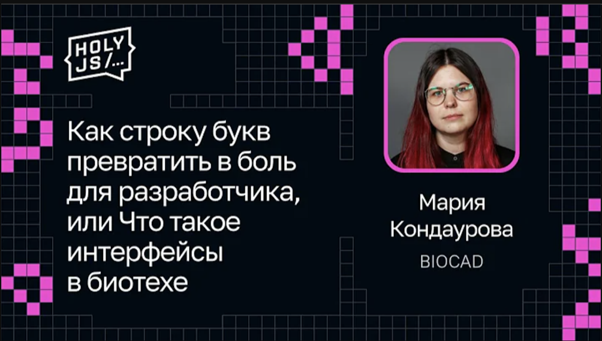
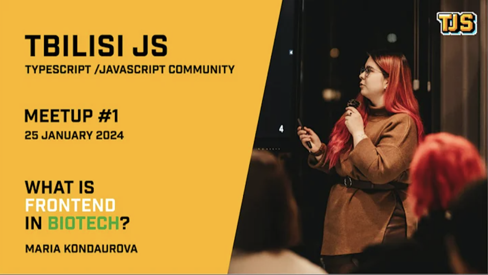
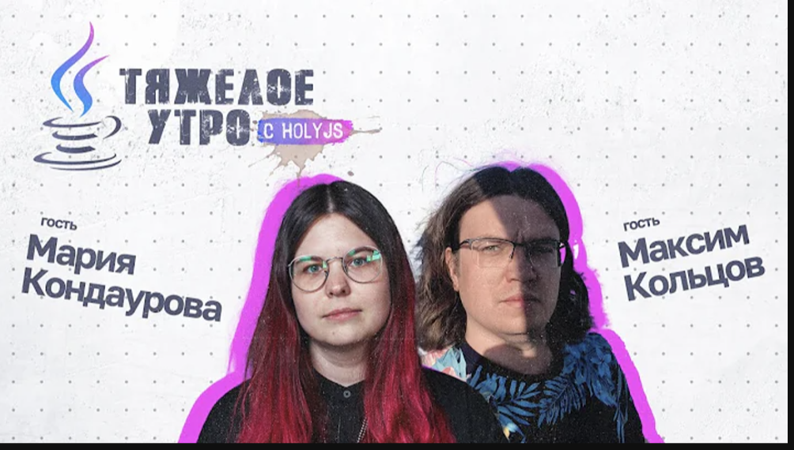
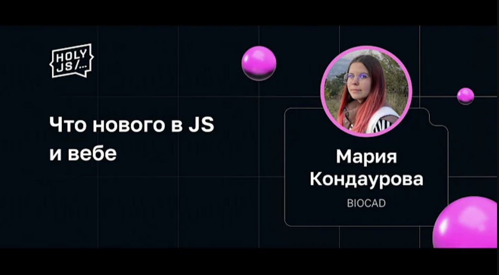

## Привет, меня зовут Мария Кондаурова

Я руковожу группой разработки интерфейсов в Департаменте Вычислительной Биологии в BIOCAD. 

Также я участвую в организации [SPB Frontend](https://spb-frontend.ru/).

Скорее всего вы сюда зашли, так как были на моем выступлении или смотрели его в записи. Спасибо ❤️

## Мои выступления: 

### 2024

### 2023

